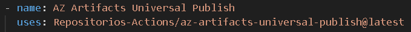
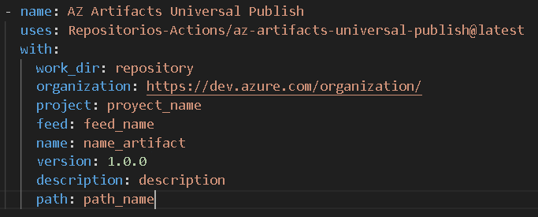

# Az artifact universal publish

Publica tus artefactos universales en los repositorios de artefacto de Azure DevOps

## ¿Que es az artifact universal publish?

Este Actions facilita la publicación de artefactos tipo universal en los repositorios de artefactos de Azure DevOps.

## Prerrequisitos

Se debe indicar con la etiqueta 'with' algunos parametros.

1. organization
2. project
3. feed
4. name
5. version
6. description
7. path

## Instrucciones

1. Copiar el llamado del action en el maketplace de GitHub. Recomendamos usar siempre la ultima versión.

Ejemplo:

  

2. Pega en tu workflow y añade la etiqueta with: añadiendo los parametros: "work_dir" y "artifact_name".

Ejemplo:

  

Se debe indicar el valores que corresponden. Nota: se puedes colocar los valores directos otra forma de trabajar es variabilizar los valores.

Ejemplo 2:

  

## Ejecución por consola

1. mkdir -p work_dir/artifact_name
2. cd work_dir && ls -l